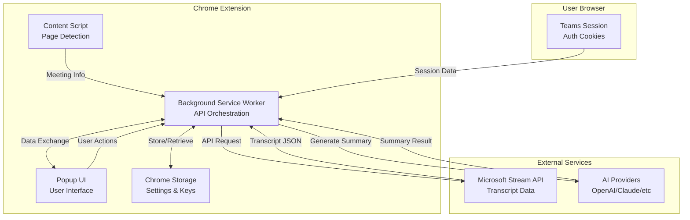

# Design - Teams Transcript Chrome Extension (MVP)

## Overview
A Chrome Extension that extracts Microsoft Teams meeting transcripts from SharePoint Stream pages using the user's authenticated session via Microsoft Stream API, then generates AI-powered summaries with customizable prompts and multi-language support. The extension operates entirely client-side without backend dependencies, using user-provided AI API keys.

## Architecture



## Components and Interfaces

### 1. Manifest Configuration (manifest.json)
```json
{
  "manifest_version": 3,
  "name": "Teams Meeting Summarizer",
  "version": "1.0.0",
  "description": "Extract Teams transcripts and generate AI summaries",
  "permissions": [
    "activeTab",
    "storage",
    "webRequest",
    "cookies"
  ],
  "host_permissions": [
    "https://*.sharepoint.com/*",
    "https://teams.microsoft.com/*",
    "https://api.openai.com/*",
    "https://api.anthropic.com/*"
  ],
  "action": {
    "default_popup": "popup.html",
    "default_title": "Summarize Meeting"
  },
  "content_scripts": [{
    "matches": [
      "https://*.sharepoint.com/*/stream.aspx*",
      "https://teams.microsoft.com/*"
    ],
    "js": ["content.js"]
  }],
  "background": {
    "service_worker": "background.js"
  }
}
```

### 2. Content Script (content.js)
**Purpose**: Detect meeting recording pages and extract meeting metadata

```javascript
// Meeting detection - specifically for SharePoint Stream pages
const STREAM_PAGE_PATTERN = /\/_layouts\/15\/stream\.aspx\?id=/;

// Extract meeting metadata from SharePoint Stream page
function extractMeetingInfo() {
  // Example URL: https://cht365-my.sharepoint.com/personal/day_cht_com_tw/_layouts/15/stream.aspx?id=/personal/day_cht_com_tw/Documents/錄製/...
  const urlParams = new URLSearchParams(window.location.search);
  const meetingPath = urlParams.get('id'); // e.g., "/personal/day_cht_com_tw/Documents/錄製/..."
  
  // Extract from SharePoint page context
  const spContext = window._spPageContextInfo || {};
  
  // Parse video player data
  const videoPlayer = document.querySelector('video-player') || {};
  const playerConfig = videoPlayer.config || {};
  
  // Extract IDs from player configuration or API calls
  const driveId = playerConfig.driveId || extractFromNetworkCalls('driveId');
  const itemId = playerConfig.itemId || extractFromNetworkCalls('itemId');
  const transcriptId = playerConfig.transcriptId || extractFromNetworkCalls('transcriptId');
  
  return {
    url: window.location.href,
    meetingPath: decodeURIComponent(meetingPath),
    title: document.querySelector('[data-automation-id="video-title"]')?.textContent,
    duration: document.querySelector('[data-automation-id="video-duration"]')?.textContent,
    siteUrl: spContext.siteAbsoluteUrl || window.location.origin,
    driveId,
    itemId,
    transcriptId
  };
}

// Monitor network requests to extract IDs
function extractFromNetworkCalls(idType) {
  // Intercept fetch/XHR calls to extract IDs from API URLs
  // This runs in content script context
}

// Message to background script
chrome.runtime.sendMessage({
  action: 'meetingDetected',
  data: extractMeetingInfo()
});
```

### 3. Background Service Worker (background.js)
**Purpose**: Handle API calls, session management, and AI processing

```javascript
// Session management
async function getAuthHeaders() {
  const cookies = await chrome.cookies.getAll({
    domain: '.sharepoint.com'
  });
  
  // Extract necessary auth tokens
  const authToken = await extractBearerToken();
  const sessionCookies = cookies.map(c => `${c.name}=${c.value}`).join('; ');
  
  return {
    'Authorization': `Bearer ${authToken}`,
    'Cookie': sessionCookies,
    'Accept': '*/*',
    'X-MS-Client-Request-Id': generateUUID()
  };
}

// Transcript extraction
async function fetchTranscript(meetingInfo) {
  const { siteUrl, driveId, itemId, transcriptId } = meetingInfo;
  
  const apiUrl = `${siteUrl}/_api/v2.1/drives/${driveId}/items/${itemId}/media/transcripts/${transcriptId}/streamContent?format=json`;
  
  const headers = await getAuthHeaders();
  
  const response = await fetch(apiUrl, {
    method: 'GET',
    headers: {
      ...headers,
      'Application': 'OnePlayer',
      'Scenario': 'LoadPlayer',
      'Type': 'AUO'
    }
  });
  
  if (!response.ok) {
    throw new Error(`API Error: ${response.status}`);
  }
  
  return await response.json();
}

// Format transcript for AI processing
function formatTranscriptForAI(transcript) {
  // Group entries by speaker for better context
  const formattedEntries = transcript.entries.map(entry => {
    const time = entry.startOffset.split('.')[0]; // Remove milliseconds
    return `[${time}] ${entry.speakerDisplayName}: ${entry.text}`;
  });
  
  // Add meeting metadata
  const participants = [...new Set(transcript.entries.map(e => e.speakerDisplayName))];
  const duration = calculateDuration(transcript.entries);
  
  return {
    metadata: {
      participants,
      duration,
      language: transcript.entries[0]?.spokenLanguageTag || 'zh-tw'
    },
    content: formattedEntries.join('\n')
  };
}

// AI Summary Generation
async function generateSummary(transcript, settings) {
  const { provider, apiKey, prompt, language } = settings;
  
  // Format transcript for AI
  const formatted = formatTranscriptForAI(transcript);
  
  // Provider-specific implementations
  switch (provider) {
    case 'openai':
      return await callOpenAI(apiKey, prompt, formatted, language);
    case 'anthropic':
      return await callAnthropic(apiKey, prompt, formatted, language);
    default:
      throw new Error('Unsupported AI provider');
  }
}
```

### 4. Popup UI (popup.html + popup.js)
**Purpose**: User interface for configuration and summary generation

```html
<!-- popup.html -->
<!DOCTYPE html>
<html>
<head>
  <link rel="stylesheet" href="popup.css">
</head>
<body>
  <div id="app">
    <!-- Setup View -->
    <div id="setup-view" class="view">
      <h2>Setup AI Provider</h2>
      <select id="provider-select">
        <option value="openai">OpenAI</option>
        <option value="anthropic">Claude (Anthropic)</option>
      </select>
      <input type="password" id="api-key" placeholder="Enter API Key">
      <button id="save-settings">Save Settings</button>
    </div>
    
    <!-- Main View -->
    <div id="main-view" class="view">
      <div id="meeting-info">
        <h3 id="meeting-title"></h3>
        <span id="meeting-duration"></span>
      </div>
      
      <button id="extract-transcript" class="primary-btn">
        Extract Transcript
      </button>
      
      <div id="transcript-preview" class="hidden">
        <h4>Transcript Preview</h4>
        <div id="transcript-content"></div>
        <button id="generate-summary">Generate Summary</button>
      </div>
      
      <div id="summary-view" class="hidden">
        <h4>Meeting Summary</h4>
        <div id="summary-tabs">
          <button class="tab active" data-format="rendered">Preview</button>
          <button class="tab" data-format="markdown">Markdown</button>
          <button class="tab" data-format="html">HTML</button>
        </div>
        <div id="summary-content"></div>
        <div id="export-buttons">
          <button id="download-md">Download .md</button>
          <button id="copy-html">Copy HTML</button>
        </div>
      </div>
    </div>
    
    <!-- Settings View -->
    <div id="settings-view" class="view">
      <h3>Prompt Templates</h3>
      <select id="prompt-select">
        <option value="default">Default Summary</option>
        <option value="action-items">Action Items Focus</option>
        <option value="technical">Technical Meeting</option>
        <option value="custom">Custom</option>
      </select>
      <textarea id="custom-prompt" class="hidden"></textarea>
      
      <h3>Output Language</h3>
      <select id="language-select">
        <option value="en">English</option>
        <option value="zh-TW">繁體中文</option>
        <option value="zh-CN">简体中文</option>
        <option value="ja">日本語</option>
      </select>
    </div>
  </div>
  <script src="popup.js"></script>
</body>
</html>
```

## Data Models

### Transcript Structure (from Microsoft Stream API)
```typescript
interface StreamTranscript {
  $schema: string;
  version: string;
  type: "Transcript";
  entries: Array<{
    id: string;                      // Unique entry ID
    speechServiceResultId: string;   // Speech service ID
    text: string;                    // Transcript text
    speakerId: string;               // Speaker UUID
    speakerDisplayName: string;      // Speaker name
    confidence: number;              // Recognition confidence (0-1)
    startOffset: string;             // Format: "HH:MM:SS.fffffff"
    endOffset: string;               // Format: "HH:MM:SS.fffffff"
    hasBeenEdited: boolean;          // Manual edit flag
    roomId: string | null;           // Room identifier
    spokenLanguageTag: string;       // e.g., "zh-tw"
  }>;
  events: Array<{
    id: string;
    eventType: "CallStarted" | "TranscriptStarted" | "TranscriptPublished" | "TranscriptStopped";
    userId: string;
    userDisplayName: string;
    startOffset: string;
  }>;
}
```

### Internal Data Models
```typescript
interface MeetingInfo {
  url: string;
  title: string;
  duration: string;
  siteUrl: string;
  driveId: string;
  itemId: string;
  transcriptId: string;
}

interface SummarySettings {
  provider: 'openai' | 'anthropic';
  apiKey: string;
  prompt: string;
  language: string;
  chunkSize: number;
}

interface GeneratedSummary {
  title: string;
  date: string;
  duration: string;
  participants: string[];
  keyPoints: string[];
  actionItems: Array<{
    task: string;
    assignee?: string;
    deadline?: string;
  }>;
  decisions: string[];
  fullSummary: string;
  markdown: string;
  html: string;
}
```

## API Integration Details

### Microsoft Stream API
- **Endpoint Pattern**: `https://{tenant}.sharepoint.com/sites/{site}/_api/v2.1/drives/{driveId}/items/{itemId}/media/transcripts/{transcriptId}/streamContent`
- **Authentication**: Bearer token from user session + cookies
- **Response Format**: JSON with transcript entries
- **Rate Limits**: Inherits user's SharePoint limits

### AI Provider APIs

#### Model Specifications
- **GPT 4.1**: 1,047,576 token context window, knowledge cutoff 2024-06-01
- **Claude Sonnet 4**: 200,000 token context window, knowledge cutoff 2025-05-01

#### OpenAI Integration (Default: GPT 4.1)
```javascript
async function callOpenAI(apiKey, prompt, transcript, language) {
  const messages = [
    {
      role: 'system',
      content: `${prompt}\nOutput language: ${language}`
    },
    {
      role: 'user',
      content: `Meeting transcript:\n${transcript.content}\n\nParticipants: ${transcript.metadata.participants.join(', ')}`
    }
  ];
  
  const response = await fetch('https://api.openai.com/v1/chat/completions', {
    method: 'POST',
    headers: {
      'Authorization': `Bearer ${apiKey}`,
      'Content-Type': 'application/json'
    },
    body: JSON.stringify({
      model: 'gpt-4.1',      // Latest GPT 4.1 with 1M+ context window
      messages,
      temperature: 0.3,
      max_tokens: 32768      // Conservative output limit
    })
  });
  
  return response.json();
}
```

#### Anthropic Integration (Alternative: Claude Sonnet 4)
```javascript
async function callAnthropic(apiKey, prompt, transcript, language) {
  const response = await fetch('https://api.anthropic.com/v1/messages', {
    method: 'POST',
    headers: {
      'x-api-key': apiKey,
      'anthropic-version': '2023-06-01',
      'content-type': 'application/json'
    },
    body: JSON.stringify({
      model: 'claude-sonnet-4-0',  // Claude Sonnet 4 with 200k context
      max_tokens: 8192,            // Conservative limit for summaries
      temperature: 0.3,
      messages: [{
        role: 'user',
        content: `${prompt}\nOutput language: ${language}\n\nMeeting transcript:\n${transcript.content}\n\nParticipants: ${transcript.metadata.participants.join(', ')}`
      }]
    })
  });
  
  return response.json();
}
```

## Error Handling Strategy

### Error Types and Recovery
1. **Authentication Errors**
   - Detection: 401/403 status codes
   - Recovery: Prompt user to refresh Teams page and retry
   - Message: "Please ensure you're logged into Teams and try again"

2. **Transcript Not Available**
   - Detection: 404 or empty response
   - Recovery: Check if transcription is still processing
   - Message: "Transcript not yet available. Please wait a few minutes"

3. **API Rate Limits**
   - Detection: 429 status or specific error codes
   - Recovery: Exponential backoff with retry
   - Message: "Rate limit reached. Retrying in X seconds..."

4. **Large Transcript Handling**
   - Detection: Token count exceeds limits
   - Recovery: Automatic chunking with section summaries
   - Message: "Large transcript detected. Processing in sections..."

5. **Network Errors**
   - Detection: Network exceptions
   - Recovery: Retry with timeout
   - Message: "Connection error. Please check your network"

## Security Considerations

### Data Protection
- API keys stored in Chrome's encrypted storage
- No external telemetry or analytics
- All processing happens locally in browser
- Session tokens never stored, only used in-memory

### Content Security Policy
```json
{
  "content_security_policy": {
    "extension_pages": "script-src 'self'; object-src 'self'"
  }
}
```

## Performance Optimization

### Caching Strategy
- Cache extracted transcripts for 1 hour
- Cache generated summaries indefinitely
- Clear cache on extension update

### Resource Management
- Lazy load UI components
- Stream large transcripts in chunks
- Limit concurrent API calls to 1

## Testing Strategy

### BDD/ATDD Approach with Gherkin

Chrome Extensions are well-suited for BDD testing. We'll use Cucumber.js with Puppeteer for automated acceptance tests.

#### Feature: Transcript Extraction
```gherkin
Feature: Extract Teams Meeting Transcript
  As a meeting participant
  I want to extract transcripts from Teams recordings
  So that I can generate summaries without manual work

  Background:
    Given I am logged into SharePoint with an active session
    And I have the extension installed
    And the extension has necessary permissions

  Scenario: Successfully extract transcript from SharePoint Stream page
    Given I am on a SharePoint Stream page "https://cht365-my.sharepoint.com/personal/day_cht_com_tw/_layouts/15/stream.aspx?id=/personal/day_cht_com_tw/Documents/錄製/meeting.mp4"
    And the meeting has a transcript available
    When I click the extension icon
    And I click "Extract Transcript"
    Then I should see a progress indicator
    And the transcript should be extracted within 5 seconds
    And the transcript should show:
      | Field              | Example Value           |
      | Speaker Name       | 王小明                  |
      | Timestamp Format   | 00:00:08               |
      | Text Content       | 我們來討論下一季的計畫   |
      | Language Tag       | zh-tw                  |

  Scenario: Handle authentication failure
    Given I am on a SharePoint Stream page
    But my session has expired
    When I click the extension icon
    And I click "Extract Transcript"
    Then I should see an error message "Authentication failed. Please refresh the page and try again"
    And I should see a "Refresh Page" button

  Scenario: Handle missing transcript
    Given I am on a SharePoint Stream page without transcript
    When I click the extension icon
    And I click "Extract Transcript"
    Then I should see an error message "No transcript available for this recording"
    And I should see a suggestion "Transcripts may take a few minutes to generate after recording"

  Scenario: Extract transcript with Chinese file path
    Given I am on a SharePoint Stream page with Chinese characters in URL
    And the URL contains "/Documents/錄製/"
    When I extract the transcript
    Then the meeting path should be properly decoded
    And Chinese characters should display correctly
```

#### Feature: AI Summary Generation
```gherkin
Feature: Generate AI Meeting Summary
  As a user with extracted transcript
  I want to generate structured summaries
  So that I can quickly understand meeting outcomes

  Background:
    Given I have successfully extracted a transcript
    And I have configured my AI provider settings

  Scenario: Generate summary with GPT 4.1 in Chinese
    Given I have selected "OpenAI" as my AI provider
    And I have entered a valid GPT 4.1 API key
    And I have selected "繁體中文" as output language
    And the transcript is in Chinese (zh-tw)
    When I click "Generate Summary"
    Then I should see a progress indicator "Generating summary with GPT 4.1..."
    And the summary should be generated within 15 seconds
    And the summary should contain sections:
      | Section       | Content Example                           |
      | 主要決策      | 確定Q2產品開發方向                        |
      | 行動項目      | - 張經理: 準備技術評估報告 (月底前)        |
      | 討論主題      | 新功能規劃、技術架構討論                   |
    And the summary should be in Traditional Chinese

  Scenario: Switch between AI providers
    Given I have configured both OpenAI and Anthropic API keys
    And I have generated a summary with OpenAI
    When I switch to "Claude Sonnet 4" provider
    And I click "Regenerate Summary"
    Then I should see "Generating summary with Claude Sonnet 4..."
    And a new summary should be generated
    And I should be able to compare both summaries

  Scenario: Handle API key errors
    Given I have entered an invalid API key
    When I click "Generate Summary"
    Then I should see an error "Invalid API key. Please check your settings"
    And the transcript should remain available
    And I should see a "Go to Settings" button

  Scenario: Use custom prompt template
    Given I have created a custom prompt template for "Technical Meetings"
    And the prompt includes "Focus on technical decisions and architecture"
    When I select the custom template
    And I generate a summary
    Then the summary should emphasize technical aspects
    And architecture decisions should be highlighted

  Scenario: Handle large transcript with GPT 4.1
    Given I have a 3-hour meeting transcript
    And I'm using GPT 4.1 with 1M+ context window
    When I click "Generate Summary"
    Then the system should process the entire transcript without chunking
    And I should see "Processing large transcript..."
    And the summary should maintain context across the entire meeting
```

#### Feature: Export and Integration
```gherkin
Feature: Export Meeting Summary
  As a user with a generated summary
  I want to export it in various formats
  So that I can share it with my team

  Scenario: Export summary as Markdown
    Given I have generated a meeting summary
    When I click "Download .md"
    Then a file should download with name format "Meeting_Title_YYYY-MM-DD.md"
    And the file should contain properly formatted Markdown
    And Chinese characters should be preserved with UTF-8 encoding

  Scenario: Copy HTML for email
    Given I have generated a meeting summary
    When I click "Copy HTML"
    Then the HTML should be copied to clipboard
    And I should see a success message "Copied to clipboard!"
    And the HTML should include inline styles for email compatibility

  Scenario: Export with meeting metadata
    Given I have a summary for "產品開發週會"
    When I export the summary
    Then the export should include:
      | Metadata      | Example                    |
      | Meeting Title | 產品開發週會               |
      | Date          | 2025-01-15                |
      | Duration      | 01:30:00                  |
      | Participants  | 王小明, 李小華, 張經理      |
```

#### Feature: Settings and Configuration
```gherkin
Feature: Configure Extension Settings
  As a user
  I want to manage my API keys and preferences
  So that I can customize the extension behavior

  Scenario: First-time setup wizard
    Given I have just installed the extension
    When I click the extension icon for the first time
    Then I should see a setup wizard
    And the wizard should guide me through:
      | Step | Action                           |
      | 1    | Choose AI provider (OpenAI/Claude) |
      | 2    | Enter API key                     |
      | 3    | Select default language           |
      | 4    | Test connection                   |

  Scenario: Manage multiple API keys
    Given I am in the settings view
    When I add both OpenAI and Anthropic API keys
    Then both providers should be available in the dropdown
    And I should be able to set a default provider
    And API keys should be masked in the UI

  Scenario: Import/Export prompt templates
    Given I have created custom prompt templates
    When I click "Export Templates"
    Then a JSON file should download with all my templates
    When I click "Import Templates" on another device
    And I select the exported JSON file
    Then all templates should be restored
```

### Test Implementation Structure
```javascript
// test/features/step_definitions/transcript_steps.js
const { Given, When, Then } = require('@cucumber/cucumber');
const { expect } = require('chai');
const puppeteer = require('puppeteer');

Given('I am on a SharePoint Stream page with URL containing {string}', async function(urlPattern) {
  this.page = await this.browser.newPage();
  await this.page.goto('https://test-tenant.sharepoint.com/_layouts/15/stream.aspx?id=test-video');
});

When('I click the extension icon', async function() {
  // Puppeteer extension testing
  const targets = await this.browser.targets();
  const extensionTarget = targets.find(target => target.type() === 'service_worker');
  const extensionUrl = extensionTarget.url();
  await this.page.goto(`${extensionUrl}/popup.html`);
});

Then('the transcript should be displayed within {int} seconds', async function(seconds) {
  await this.page.waitForSelector('#transcript-content', {
    timeout: seconds * 1000
  });
  const transcript = await this.page.$eval('#transcript-content', el => el.textContent);
  expect(transcript).to.include('speakerDisplayName');
});
```

### Unit Tests
- Transcript parsing logic
- API response handling
- Summary formatting
- Error recovery mechanisms
- Token counting and chunking

### Integration Tests
- End-to-end flow with mock APIs
- Session token extraction
- Multi-provider summary generation (GPT 4.1, Claude Sonnet 4)
- Export functionality
- Chrome storage operations

### E2E Testing with Real Services
```javascript
// test/e2e/real_api_test.js
describe('Real API Integration', () => {
  it('should generate summary with GPT 4.1', async () => {
    const result = await generateSummary(mockTranscript, {
      provider: 'openai',
      apiKey: process.env.OPENAI_TEST_KEY,
      model: 'gpt-4.1',
      language: 'zh-TW'
    });
    
    expect(result).to.have.property('keyPoints');
    expect(result.keyPoints).to.be.an('array');
  });
});
```

### Manual Testing Checklist
- [ ] Various SharePoint tenant URLs (including Chinese paths)
- [ ] Different meeting durations (5min to 3hr+)
- [ ] GPT 4.1 with different prompts (1M+ context window)
- [ ] Claude Sonnet 4 comparison (200k context)
- [ ] Chinese/English language switching
- [ ] API key validation and error messages
- [ ] Export formats (Markdown, HTML, plain text)
- [ ] Large transcript chunking