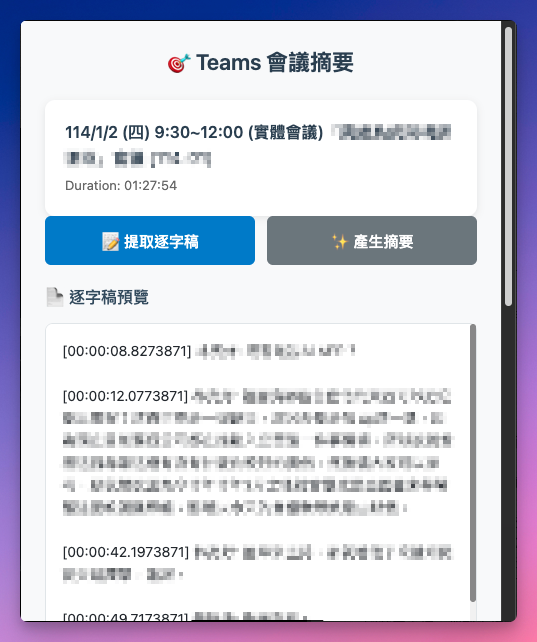
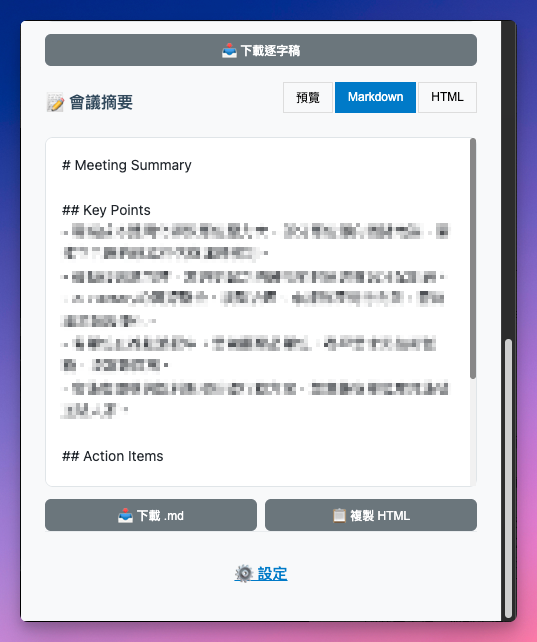
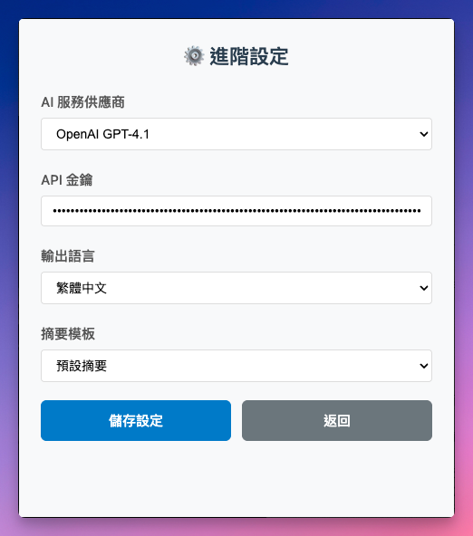

# Teams Meeting Summarizer Chrome Extension

A Chrome Extension that extracts Microsoft Teams meeting transcripts from SharePoint Stream pages using the user's authenticated session via Microsoft Stream API, then generates AI-powered summaries with customizable prompts and multi-language support.

## Features

- ✅ **One-click transcript extraction** from SharePoint Stream pages
- ✅ **AI-powered summaries** using GPT 4.1 or Claude Sonnet 4
- ✅ **Multi-language support** (English, Chinese, Japanese)
- ✅ **Customizable prompts** for different meeting types
- ✅ **Multiple export formats** (Markdown, HTML, Plain text)
- ✅ **Secure API key storage** using Chrome's encrypted storage
- ✅ **Client-side processing** - no backend dependencies

## Product Demo

### Main Interface
The extension popup provides a clean, intuitive interface for meeting transcript extraction and summary generation.



### AI-Generated Summary Output
View structured summaries with key points and action items, with options to export in multiple formats.



### Advanced Settings
Configure your AI provider, API credentials, output language, and summary templates to customize your experience.



## Installation

### Development Setup

1. **Clone or download** this extension folder
2. **Install dependencies**:
   ```bash
   npm install
   ```
3. **Build the extension**:
   ```bash
   npm run build
   ```
4. **Load in Chrome**:
   - Open Chrome and navigate to `chrome://extensions/`
   - Enable "Developer mode" in the top right
   - Click "Load unpacked" and select the `dist` folder

### Production Build

```bash
npm run build
```

The built extension will be in the `dist/` folder.

## Usage

### 1. First Time Setup
- Click the extension icon in Chrome
- Select your AI provider (OpenAI GPT 4.1 or Claude Sonnet 4)
- Enter your API key
- Choose default output language
- Save settings

### 2. Extracting Transcripts
- Navigate to a SharePoint Stream page with Teams recording
- Click the extension icon
- Click "Extract Transcript"
- Wait for transcript to load

### 3. Generating Summaries
- After transcript extraction, click "Generate Summary"
- Choose prompt template (default, action items, technical, or custom)
- Select output language
- Get AI-generated summary

### 4. Export Options
- **Download as Markdown**: Get a .md file
- **Copy as HTML**: For email or web use
- **Preview**: See formatted summary before export

## Target URLs

The extension works on SharePoint Stream pages with this URL pattern:
```
https://{tenant}.sharepoint.com/personal/{user}/_layouts/15/stream.aspx?id=/personal/{user}/Documents/錄製/{filename}
```

## API Requirements

### OpenAI GPT 4.1 (Default)
- **API Key**: Required from OpenAI
- **Model**: gpt-4.1 (1,047,576 token context window)
- **Endpoint**: https://api.openai.com/v1/chat/completions

### Claude Sonnet 4 (Alternative)
- **API Key**: Required from Anthropic
- **Model**: claude-sonnet-4-0 (200,000 token context window)
- **Endpoint**: https://api.anthropic.com/v1/messages

## Development

### Project Structure
```
.
├── src/
│   ├── api/                 # API clients (OpenAI, Claude, Stream)
│   ├── background/          # Service worker (TypeScript)
│   ├── content/             # Content script (TypeScript)
│   ├── popup/               # Extension popup UI (TypeScript)
│   ├── storage/             # Storage management
│   ├── export/              # Export functionality
│   ├── prompt/              # Prompt templates
│   ├── ui/                  # UI components
│   └── utils/               # Shared utilities (TypeScript)
├── assets/                  # Icons and static files
├── docs/                    # Documentation and screenshots
├── test/                    # Test files (unit, integration, BDD)
├── examples/                # Usage examples and demos
├── manifest.json            # Extension manifest
├── webpack.config.js        # Build configuration
├── tsconfig.json           # TypeScript configuration
└── dist/                   # Built extension files
```

### Available Scripts

- `npm run build` - Build for production
- `npm run dev` - Build for development with watch mode
- `npm run test` - Run unit tests
- `npm run test:bdd` - Run BDD tests with Cucumber.js
- `npm run test:bdd:smoke` - Run smoke tests only
- `npm run test:bdd:regression` - Run regression test suite
- `npm run lint` - Run ESLint
- `npm run type-check` - Run TypeScript type checking

### Testing

## Testing Status
- **Unit Tests**: 295 passing, 18 skipped
- **Integration Tests**: 2 test suites passing
- **Test Suites**: 11 passed, 1 skipped (12 total)
- **BDD Smoke Tests**: 8 scenarios (8 passed), 76 steps (76 passed) - 100%
- **BDD Regression Tests**: 60 scenarios (60 passed), 529 steps (529 passed) - 100%
- **E2E Tests**: Available (manual testing required)
- **API Integration Tests**: Available (requires API keys)
- **Manual Testing**: See [Manual Testing Guide](./MANUAL_TESTING_GUIDE.md) for E2E and API integration tests

## Testing Commands
```bash
# Run all automated tests
npm test

# Run BDD tests
npm run test:bdd

# View test reports
open test/bdd/reports/cucumber-report.html
```

### Key Technologies

- **TypeScript** for type safety and modern development
- **Manifest V3** for Chrome Extension API compliance
- **Webpack 5** for efficient bundling and optimization
- **Jest** for comprehensive unit and integration testing
- **Cucumber.js** for BDD testing with Gherkin scenarios
- **ESLint** with TypeScript support for code quality
- **Chrome Extension APIs** for browser integration

## Security

- **API keys stored securely** using Chrome's encrypted storage
- **No external servers** - all processing is client-side
- **Session tokens** captured from user's active session (no OAuth)
- **No data collection** - respects user privacy

## Error Handling

The extension provides helpful error messages for:
- Authentication failures
- Missing transcripts
- API rate limits
- Network issues
- Invalid API keys

## Browser Compatibility

- **Chrome** (recommended)
- **Edge** (Chromium-based)
- **Brave** (Chromium-based)

## Contributing

1. Fork the repository
2. Create a feature branch
3. Make your changes
4. Test thoroughly
5. Submit a pull request

## License

Licensed under the Apache License 2.0 - see [LICENSE](LICENSE) file for details.

Copyright 2025 Kehao Chen <kehao.chen@happyhacking.ninja>

## Support

For issues or questions:
1. Check the error messages in the extension popup
2. Verify your API key is valid
3. Ensure you're on a SharePoint Stream page
4. Check browser console for detailed logs